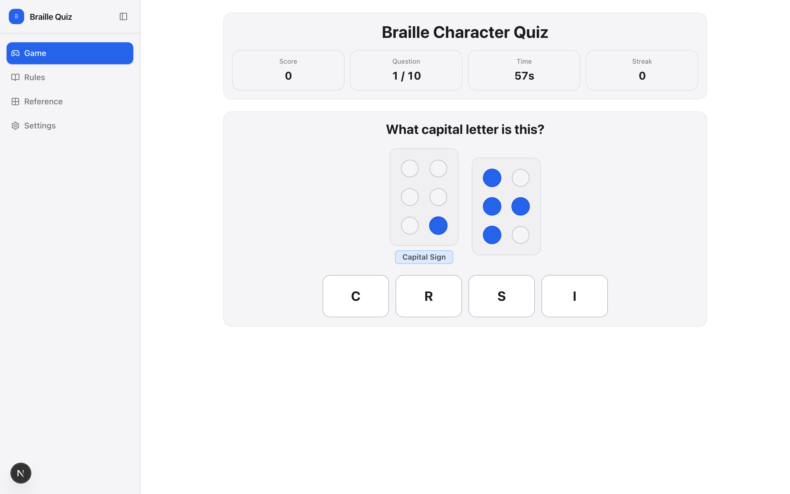

# Braille Character Quiz Game

An interactive web-based game for learning and practicing Braille characters. Test your knowledge of Braille letters, numbers, and symbols through an engaging multiple-choice quiz format.




## Features

### Interactive Learning
- **Lowercase Letters** — Practice the basic Braille alphabet (a–z)
- **Capital Letters** — Learn capital letter notation with the capital sign (⠠)
- **Numbers** — Master numeric Braille with the number sign (⠼)
- **Visual Braille Display** — Flat, high-contrast dot patterns for active/inactive dots

### Game Mechanics
- **Timed Challenges** — Configurable 10–300 second sessions
- **Multiple Choice** — Four options per question
- **Real-time Feedback** — Instant correct/incorrect responses
- **Scoring System** — 10 points per correct answer
- **Streak Tracking** — Monitor consecutive correct answers
- **Persistent Statistics** — Stored in `localStorage`

### Experience
- **Flat-Color Design** — No gradients, no glassmorphism; crisp surfaces and a single accent
- **Theming** — Light/dark themes plus six cyclable accent palettes
- **Responsive** — Works on phones, tablets, and desktops
- **Accessible** — Keyboard navigation, focus-visible rings, `prefers-reduced-motion` support, ARIA labels

## Design Language

The full visual system is documented in [`DESIGN_LANGUAGE.md`](./DESIGN_LANGUAGE.md). Key tenets:

- **Flat by default** — `linear-gradient`, `radial-gradient`, `conic-gradient`, and `backdrop-filter` are forbidden.
- **One accent** — A single accent (purple / teal / emerald / amber / rose / blue) carries the brand; all surfaces are opaque neutral tokens.
- **Token-driven** — All colors, radii, and spacing live as CSS custom properties so themes and accents swap without code changes.

## Getting Started

### Prerequisites
- Node.js 18+ (Node 20 recommended)
- npm

### Install & Run
```bash
npm install
npm run dev      # http://localhost:3000
```

### Production Build
```bash
npm run build    # outputs static export to ./out
npm run start    # serve the production build locally
```

### Quality Commands
```bash
npm run lint
npm run typecheck
node scripts/verifyBraillePatterns.cjs   # validate braille unicode vs dot patterns
```

## Tech Stack

| Layer       | Choice                                                  |
| ----------- | ------------------------------------------------------- |
| Framework   | Next.js 15 (App Router, static export)                  |
| Language    | TypeScript 5                                           |
| Styling     | CSS Modules + global token sheet (`globals.css`)       |
| State       | React hooks (`useReducer`, `useContext`) — RxJS removed |
| Persistence | `localStorage` via small typed helpers (`src/lib`)      |
| Deploy      | GitHub Pages via Actions (artifact from `./out`)        |

## Project Structure

```
src/
├── app/
│   ├── layout.tsx          # Root layout + providers
│   ├── page.tsx            # Game (home route)
│   ├── globals.css         # Design tokens + base styles
│   ├── rules/              # How-to-play page
│   └── reference/          # Braille alphabet reference
├── components/
│   ├── AppShell.tsx        # Layout shell (sidebar + main + toggles)
│   ├── Sidebar.tsx         # Collapsible primary navigation
│   ├── ThemeProvider.tsx   # Theme + accent context
│   ├── ThemeToggle.tsx     # Dark/light + accent cycle buttons
│   ├── GameScreen.tsx      # Quiz UI
│   ├── BraillePattern.tsx  # 6-dot cell renderer
│   └── BrailleSequence.tsx # Multi-cell display (signs + chars)
├── hooks/
│   ├── useGameSession.ts   # Timer, scoring, question flow
│   └── useGameStats.ts     # Stats + persisted settings
├── lib/
│   ├── questionGenerator.ts
│   └── gameStorage.ts
├── data/brailleData.ts     # All Braille character definitions
└── types/braille.ts        # Shared interfaces
```

## How to Play

1. **Start**: Pick difficulty, game length, and question count, then press Start Game.
2. **Read the Pattern**:
   - Single pattern → lowercase letter
   - Capital sign (⠠) + pattern → capital letter
   - Number sign (⠼) + pattern → number
3. **Answer**: Choose from four options; each correct answer scores 10 points.
4. **Track Progress**: Watch your score, streak, and timer; stats persist across sessions.

## Deployment

Pushes to `main` deploy to GitHub Pages automatically via `.github/workflows/deploy.yml`. The static export lives at `./out` after `npm run build`, and `next.config.ts` sets `basePath: '/braille-quiz-game'` for the production subpath.

Live demo: <https://pjrus.github.io/braille-quiz-game>

## License

MIT — see `LICENSE` (or this repo's history) for details.

## Acknowledgments

- Braille notation follows Unified English Braille (UEB) conventions.
- Built with the Next.js App Router and modern React patterns.